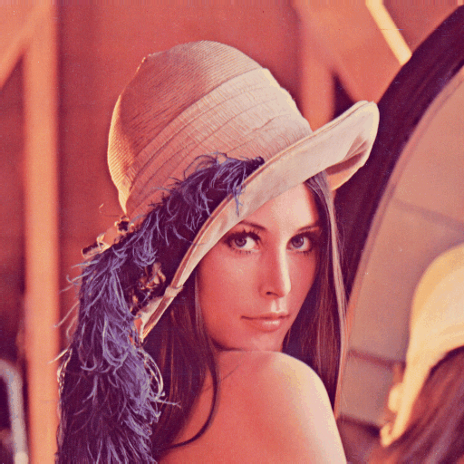
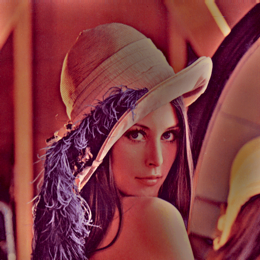

# homomorphic-rgb-filtering

The homomorphic filtering principle by utilizing the LAB colorspace to apply in RGB images.

Convert the image to LAB, perform the frequency domain filtering on the L component, and merge again to yield the output RGB image.

#### Input

#### Output

